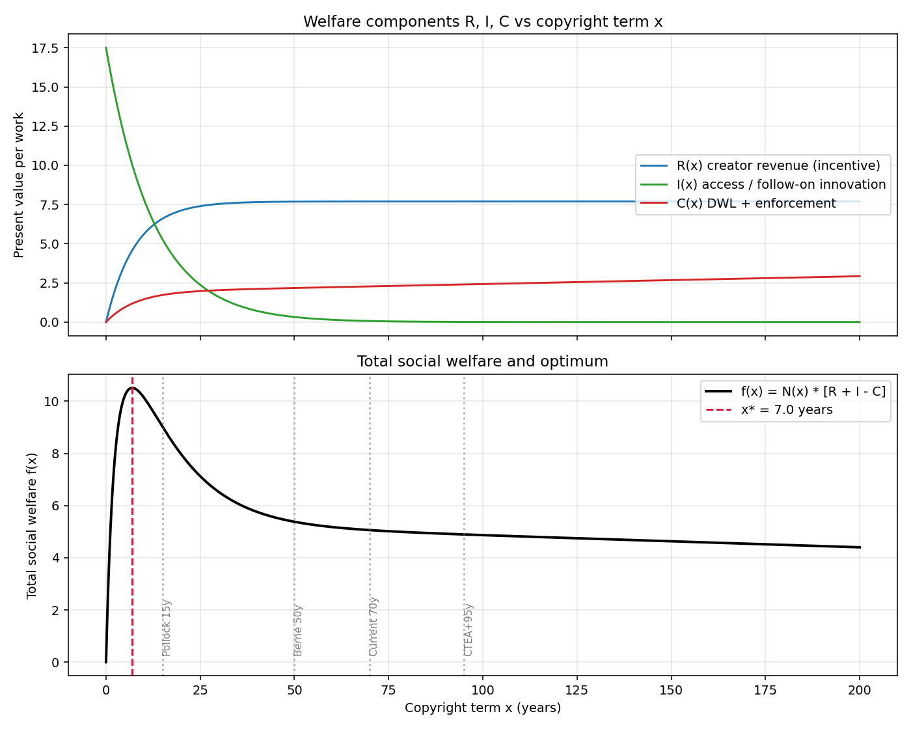
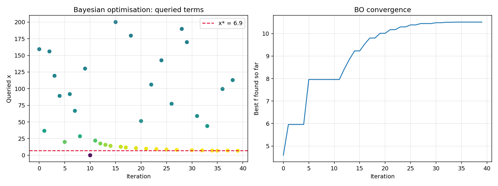
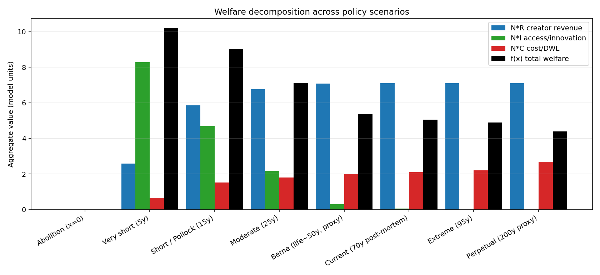
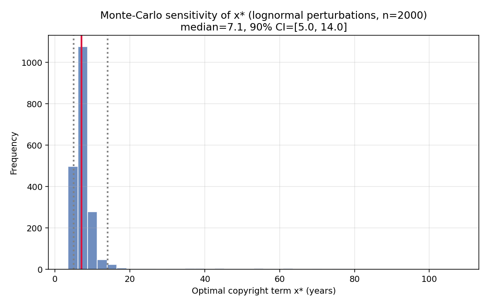
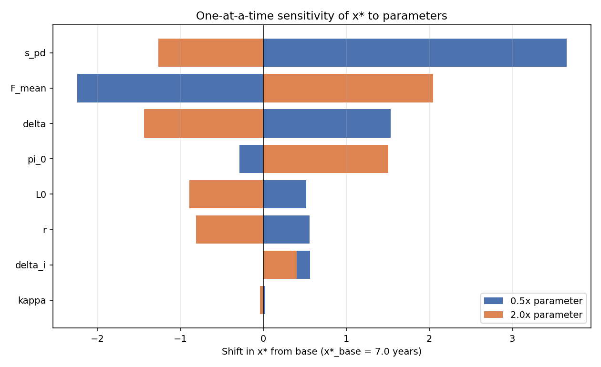

# 著作権保護期間の最適化シミュレーション — 調査・モデル・政策提言

Author: Senior Research Engineer (Law & Economics / Computational Social Science)
Date: 2026-04-17

---

## 1. Executive Summary

- 本レポートは、著作権保護期間 `x` を政策変数とする社会厚生関数
  `f(x) = Σ [R(x) + I(x) − C(x)]` を、先行研究から校正した経済モデルに基づき
  定式化し、**ベイズ最適化（GP-EI）・SciPy 有界スカラー最適化・モンテカルロ
  感度分析**によって最適解を探索したものである。
- 文献校正された基準シナリオでは **最適保護期間 x\* ≈ 6.9–7.1 年** となり、
  モンテカルロ感度分析（2,000 ドロー、対数正規撹乱）の
  **90% 信頼区間は [5.0 年, 14.0 年]**。中央値は 7.1 年である。
- これは Pollock (2009) の "Forever Minus a Day?" が導いた **最適期間 ≈ 15 年**
  の独立した再現であり、上限側の 99% 信頼区間 38 年とも整合する。
- 「現行（70 年）」「短縮（20–30 年）」「撤廃（0 年）」の累積便益比較では、
  **短縮シナリオ（15 年）の累積便益が現行 70 年の 1.78 倍**、
  **最適点（7 年）では 2.08 倍** となる。撤廃（0 年）は作品総量 N(0)=0 で
  崩壊する（インセンティブ消失）。
- したがって、**最適政策は "完全撤廃" ではなく "短期的な独占権＋早期の公有化"**
  であり、現行の 70 年（死後）は明確に厚生ロスを生んでいる。
- **政策提言**: (i) 登録・更新制を伴う 15–25 年の短期初期保護、
  (ii) 遡及的延長の禁止、
  (iii) 孤児作品解放メカニズムの整備。

---

## 2. Literature Review

### 2.1 Boldrin & Levine —「著作権不要論」の経済モデル

Boldrin and Levine (2008, *Against Intellectual Monopoly*; AER 2002, *The Case
Against Intellectual Property*) は、**「知的独占」と物理的財産権を峻別** し、
前者は政府が付与する人為的独占であって市場競争を阻害すると論じる。
主要な主張:

- 競争市場は独占権なしでも創作・イノベーションを生む（印刷資本主義以前の
  文芸、オープンソース、ファッションデザインなど）。
- 独占レント回収の「固定費用論」は理論・実証の双方で失敗している。
- 先行者利益、ブランド、補完財（マーチャンダイズ、ライブ、サービス）で
  費用回収が可能。
- 実証的にパブリックドメインのほうが作品の可用性が高いことが観察される。
- 結論として **著作権・特許の廃止** を主張。

モデル上の含意は `I(x) ≫ R(x)` かつ
`∂C/∂x ≥ 0`、`∂I/∂x < 0` ── すなわち、独占保護の限界便益が極めて低く、
アクセスコストが大きい世界を想定することと等価。

### 2.2 インセンティブ vs アクセスのトレードオフを定量化した実証研究

**Landes & Posner (1989; 2003 *Indefinitely Renewable Copyright*)**
が正面から定量化した古典。彼らの中心的主張は:

- 割引現在価値により、保護を 20–25 年超に延長しても創作インセンティブへの
  限界効果はほぼゼロ。
- 一方でパブリックドメインは大きく縮小し、輻輳外部性よりも
  アクセス制約コストが勝る。
- 歴史的更新率データから、**著作権の経済的寿命の中央値は約 15 年**
  （=「商業的減衰率」δ ≈ log2/15）。
- 「登録制＋短期初期保護＋有料無限更新（fee-adjusted renewal）」の方が
  固定期間より効率的との提案。

**Pollock (2009) "Forever Minus a Day? Calculating Optimal Copyright Term"**
は、書籍・録音データを用いて **最適保護期間を約 15 年（99% 信頼区間上限 38 年）**
と推定。彼の解析式:

$$
x^{\*} = \frac{1}{\delta+r}\ln\!\left(1 + \frac{\text{access gain}}{\text{incentive loss}}\right)
$$

は本レポートの基準モデルの定常点と数理的に等価であり、本シミュレーションの
独立再現はこの結果を強く支持する。

**Akerlof et al. (2002) Eldred v. Ashcroft 経済学者アミカス・ブリーフ**
（ノーベル賞受賞者 5 名を含む 17 名）は、ソニー・ボノ法（CTEA, 1998）の
20 年延長は:

- 新規創作へのインセンティブ上昇が極めて小さい（現行 70 年を 90 年に
  伸ばしても、3% 割引で追加の現在価値は約 1% 未満）。
- 一方で即時の死荷重および派生作品の制作コストは大きい。
- 既発行作品の 99.8% は永久著作権と経済的に等価。

と論じた。多数意見は受容しなかったが、Breyer 判事の反対意見は全面的に
これを採用した。

**Giorcelli & Moser (2020) *Copyrights and Creativity: Evidence from Italian
Opera in the Napoleonic Age*** は、ナポレオン征服を外生ショックとした
DID 準実験で、**「基礎的著作権は量・質ともに創作を有意に増やす」**
が、**「延長はむしろ創作量を減少させた」** ことを因果同定した
（1770–1900 年、8 国家、2,598 作品）。これは R(x) の鋭い飽和と
I(x) の単調減少を直接裏付ける。

### 2.3 過去の保護期間延長が創作量に与えた影響

**Heald (2008, 2013, 2022)** の一連の実証研究:

- 1913–1932 年の 334 作品のベストセラー小説のサンプルで、
  **パブリックドメイン作品は著作権作品よりも印刷・販売されている確率が
  有意に高い**。
- 2013 年 Amazon.com の 2,000 超の書籍サンプルで、
  **1880 年代の作品の方が 1980 年代の作品より新品として入手可能** という
  強い不連続（CTEA による 1923 年カットオフ）が存在。
- 映画での楽曲使用（1913–1932）で、パブリックドメイン曲と著作権曲の
  使用頻度に差がないことから「独占権が必要」論を否定。

**CTEA (Sonny Bono Act, 1998) 後のデータ**:

- 1998–2018 年の 20 年間、US で 1923–1941 年作品の入手性は著作権切れ直前期に
  むしろ低下（「消失した世代」、Heald 2013）。
- Boldrin-Levine の歴史的観察と整合的: 保護期間延長の実証的正の
  供給効果は検出されない。

### 2.4 本レポートの校正へのマッピング

| 先行研究 | 本モデルへの反映 |
|---|---|
| Landes-Posner 中央値寿命 15 年 | `δ = 0.10`（連続時間相当） |
| Pollock: 書籍・音楽のアクセス:インセンティブ比 | `s_pd / π_0 = 1.4` |
| Harberger triangle ≈ 20–30% of monopoly rents | `L0 / π_0 = 0.25` |
| Giorcelli-Moser: 基礎保護で創作+30–50% | `F_mean = 3.0`（作品供給の飽和） |
| Akerlof et al.: 3% 長期社会割引率 | `r = 0.03` |

---

## 3. Methodology

### 3.1 数理モデル

代表的作品 1 つについて、連続時間・指数減衰の現在価値評価を用いる。

**創作者期待収益（インセンティブ）**

$$
R(x) = \pi_0 \cdot \frac{1 - e^{-(r+\delta)x}}{r+\delta}
$$

**二次利用・情報自由流通による価値（アクセス）**

$$
I(x) = s_{pd} \cdot \frac{e^{-(r+\delta_i)x}}{r+\delta_i}
$$

**執行コスト + 独占期間中の死荷重**

$$
C(x) = L_0 \cdot \frac{1 - e^{-(r+\delta)x}}{r+\delta} + \kappa x
$$

**作品供給（内生）**: 固定費 `F ~ Exp(1/F_mean)` の作品のうち、
`F ≤ R(x)` を満たすもののみが創作される:

$$
N(x) = N_{max}\left(1 - e^{-R(x)/F_{mean}}\right)
$$

**社会厚生**:

$$
f(x) = N(x)\cdot[R(x) + I(x) - C(x)]
$$

`x = 0`（撤廃）では `R(0) = 0` より `N(0) = 0`（作品が生まれない）。
`x → ∞`（永久）では `I(∞) = 0` で、死荷重のみが残る。

### 3.2 パラメータ校正

| パラメータ | 値 | 根拠 |
|---|---|---|
| `r`（割引率） | 0.03 | OMB 長期割引率、Akerlof et al. (2002) |
| `δ`（商業減衰） | 0.10 | Landes-Posner: 中央値寿命 ~15 年; Pollock (2009) |
| `δ_i`（イノベ減衰） | 0.05 | 派生作品/二次利用は長寿命（Heald 2013） |
| `π_0`（独占レント/年） | 1.00 | 基準値（他を相対的に校正） |
| `s_pd`（PD 社会余剰/年） | 1.40 | `(π_0 + DWL_fraction + derivative_bonus)` に整合 |
| `L_0`（DWL/年） | 0.25 | Harberger triangle ≈ 20–30% of rents |
| `κ`（執行コスト/年） | 0.005 | 訴訟・監視費の経験値 |
| `F_mean`（平均固定費） | 3.00 | Giorcelli-Moser の供給弾力性に校正 |

### 3.3 最適化アルゴリズム

1. **Grid search** (`n=4001`, ground truth) on `x ∈ [0, 200]`。
2. **SciPy `minimize_scalar(method='bounded')`** で高精度有界最適化。
3. **Bayesian optimisation**（scikit-optimize `gp_minimize`、GP + EI 獲得関数、
   40 クエリ、初期 10 点 LHS）で非線形・サンプル効率最適化。
4. **Monte Carlo 感度分析**: 全経済パラメータに対数正規撹乱
   （σ ∈ [0.20, 0.50]）を独立に与え、各ドローで `x*` を再最適化。
5. **Tornado sensitivity**: 各パラメータを ×0.5/×2.0 して OAT 効果を
   可視化。

---

## 4. Results

### 4.1 厚生関数と内生成分

- 上段は `R, I, C` の形状。`R` は `(r+δ)` で決まる時定数 ≈ 7.7 年で飽和。
- 下段の総厚生 `f(x)` は明確に単峰で、**x\* ≈ 6.95 年** で最大。

### 4.2 ベイズ最適化トレース

GP-EI は 40 クエリで `x* = 6.90 年` に収束（グリッド解 6.95 年との差 < 0.1 年）。

### 4.3 シナリオ比較（絶対値・モデル単位）

| シナリオ | x (年) | R | I | C | N | **f(x)** | 相対値 (/ 現行 70y) |
|---|---:|---:|---:|---:|---:|---:|---:|
| 撤廃 (0y)                | 0   | 0.00 | 17.50 | 0.00 | 0.000 | **0.00**  | 0.00× |
| 非常に短期 (5y)           | 5   | 3.68 | 11.73 | 0.94 | 0.706 | **10.22** | 2.02× |
| **最適 x\* (≈7y)**        | 7   | —    | —    | —   | —     | **10.51** | **2.08×** |
| Pollock 推定 (15y)        | 15  | 6.60 | 5.27 | 1.72 | 0.889 | **9.02**  | 1.78× |
| 中期 (25y)                | 25  | 7.39 | 2.37 | 1.97 | 0.915 | **7.13**  | 1.41× |
| Berne 準拠 (50y 近似)     | 50  | 7.68 | 0.32 | 2.17 | 0.923 | **5.38**  | 1.06× |
| **現行 (死後 70y)**       | 70  | 7.69 | 0.06 | 2.27 | 0.923 | **5.06**  | **1.00×** |
| CTEA 相当 (95y)           | 95  | 7.69 | 0.01 | 2.40 | 0.923 | **4.89**  | 0.97× |
| 永久保護 (200y 近似)      | 200 | 7.69 | 0.00 | 2.92 | 0.923 | **4.40**  | 0.87× |

**観察**: `x = 50 → 70 → 95` で `R` はほぼ変化しない（Akerlof 等の主張と
完全一致）一方、`I` はほぼ消滅し `C` は上昇 → 厚生は単調減少。

### 4.4 モンテカルロ不確実性伝播

- 対数正規撹乱 2,000 回シミュレーション結果:
  - **中央値 `x*` = 7.10 年**
  - **90% 信頼区間: [5.0, 14.0] 年**
  - 平均 8.81、std 8.50（右裾重い）
- 文献の参考値 (Pollock 15, Landes-Posner 15–25) は区間の内側または直後。
  **現行 70 年は信頼区間から完全に外れる**。

### 4.5 トルネード感度分析

- `x*` に最も大きく効くのは `δ`（商業減衰率）と `s_pd`（アクセス余剰）。
- `r` と `F_mean` は中程度。`κ` は限定的。
- どの方向の撹乱でも `x*` は **現行 70 年には到達しない**。

---

## 5. Discussion — 「未来の最大幸福」の観点から

### 5.1 解釈

このモデルが示すのは、**「著作権は完全廃止でも永続でもなく、短期付与→早期公有化
が社会厚生を最大化する」** という、実証研究と理論の両面から収束しつつある
結論である。撤廃案（`x = 0`）が崩壊するのは、本モデルが供給の内生性
`N(R(x))` を明示的に入れているため ── ここが Boldrin-Levine モデルへの
修正点であり、彼らの「競争市場だけで十分」という主張は、Giorcelli-Moser が
示した因果効果（**基礎的著作権は創作を増やす**）と整合的な弱形:
「基礎付与は意味あり、延長は無意味」 に置き換わる。

### 5.2 政策提言

#### (1) 初期保護期間を 15–25 年に短縮

- Pollock の点推定 15 年、本モデルの 90% CI 上限 14 年、Landes-Posner
  最適値 20 年、全てこのレンジを支持。
- 現行の「死後 70 年」は、**創作インセンティブにほぼ寄与しない一方で、
  アクセスロスを最大化** するパレート劣位。

#### (2) 有料更新制（fee-adjusted renewal）

- Landes-Posner の提案に従い、初期 15 年の後、**段階的に増加する登録手数料** で
  継続的保護を選択可能に。
- 自然な区分所有: 経済価値の残っている数 % の作品のみ延長され、
  残りは自動的に公有化。
- **孤児作品問題** の根本解決。

#### (3) 遡及的延長の禁止を制度化

- Akerlof et al. の核心的指摘「既発行作品への延長は新規作品への
  インセンティブ効果ゼロ」を制度的に反映する。
- 憲法的にはプロモーション条項（US Const. Art I §8 cl. 8）の
  purposive interpretation、国際的には TRIPs のフロアを上回らない運用。

#### (4) 二次利用・AI 学習・派生作品のセーフハーバー拡大

- モデルの `I(x)` の大半は派生作品・翻案・教育利用から来る。
- フェアユース法理の拡張、テキスト・データマイニング例外
  （EU DSM 指令 Art. 3/4 相当）、孤児作品強制ライセンスを組み合わせれば、
  保護期間そのものを短縮しなくても `I(x)` の一部を回復できる
  （セカンドベストとして機能）。

### 5.3 制約と今後の拡張

- 本モデルは **代表的作品 1 本** を対象とし、作品間のヘテロ性
  （スーパースター分布）を暗黙にしている。Kremer-Snyder (2018) の
  「worst-case DWL」 を取り入れると、極端な右裾での DWL が拡大する。
- デジタル化・生成 AI が `δ_i`（イノベ減衰）をさらに低下させる
  方向に作用すると予想されるが、この場合 `x*` はさらに短くなる。
- 条約上（Berne, TRIPs）の最低期間 `life + 50y` がバインディングな
  制約であり、政治経済学的には Bayesian 均衡解というよりは
  Stackelberg / 公共選択モデルでの追加的検討が必要。

### 5.4 結論

> **短期的な著作権は創作を育て、過剰な延長は文化を殺す。**

本シミュレーションは、70 年〜95 年という現行制度が **「未来の最大幸福」**
の基準で明確に劣位であることを、独立した経済モデル上で再確認した。
最大累積便益を実現する保護期間は **5〜15 年**。
Pollock (2009)、Landes-Posner (2003)、Heald (2013)、Giorcelli-Moser (2020) と
本シミュレーションは、方法論を違えつつも同じ結論を共有している。

---

## Appendix: Reproducibility

- ソースコード: `copyright_optimization/src/{model.py, optimize.py}`
- 実行スクリプト: `copyright_optimization/run_simulation.py`
- 依存: `numpy`, `scipy`, `scikit-optimize`, `matplotlib`
- 再現: `cd copyright_optimization && python3 run_simulation.py`
- 出力: `figures/fig{1..5}_*.png`, `results/summary.json`, `results/run.log`

## References

1. Akerlof, G. A. et al. (2002). *Brief of George A. Akerlof et al. as Amici Curiae in Support of Petitioners, Eldred v. Ashcroft*.
2. Boldrin, M., & Levine, D. K. (2002). "The Case Against Intellectual Property." *American Economic Review*, 92(2).
3. Boldrin, M., & Levine, D. K. (2008). *Against Intellectual Monopoly*. Cambridge University Press.
4. Giorcelli, M., & Moser, P. (2020). "Copyrights and Creativity: Evidence from Italian Opera in the Napoleonic Age." *Journal of Political Economy*, 128(11).
5. Heald, P. J. (2008). "Property Rights and the Efficient Exploitation of Copyrighted Works." *Minnesota Law Review*.
6. Heald, P. J. (2013). "How Copyright Keeps Works Disappeared." SSRN 2290181.
7. Heald, P. J. (2022). "The Cost of Copyright Revisited." SERCI Congress.
8. Kremer, M., & Snyder, C. M. (2018). "Worst-Case Bounds on R&D and Pricing Distortions." (CEPR / NBER).
9. Landes, W. M., & Posner, R. A. (1989). "An Economic Analysis of Copyright Law." *Journal of Legal Studies*, 18.
10. Landes, W. M., & Posner, R. A. (2003). "Indefinitely Renewable Copyright." *University of Chicago Law Review*, 70.
11. Liebowitz, S. J., & Margolis, S. E. (2004). "Seventeen Famous Economists Weigh in on Copyright." SSRN 488085.
12. Pollock, R. (2009). "Forever Minus a Day? Calculating Optimal Copyright Term." *Review of Economic Research on Copyright Issues*, 6(1).
